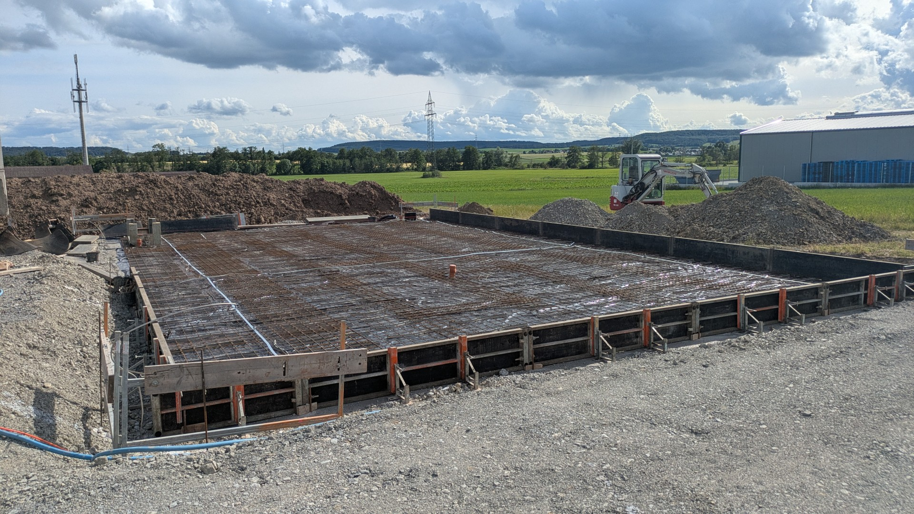
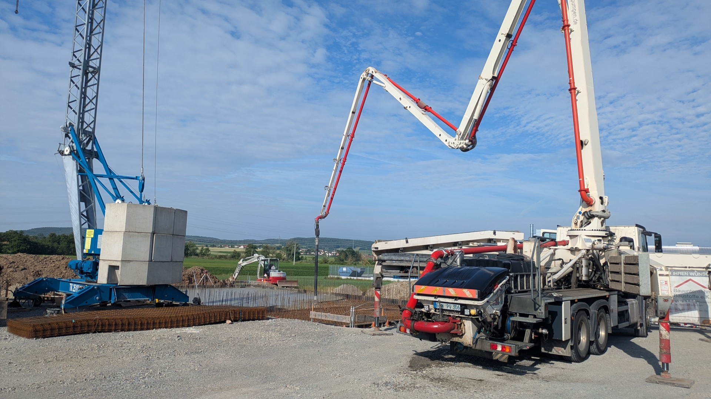
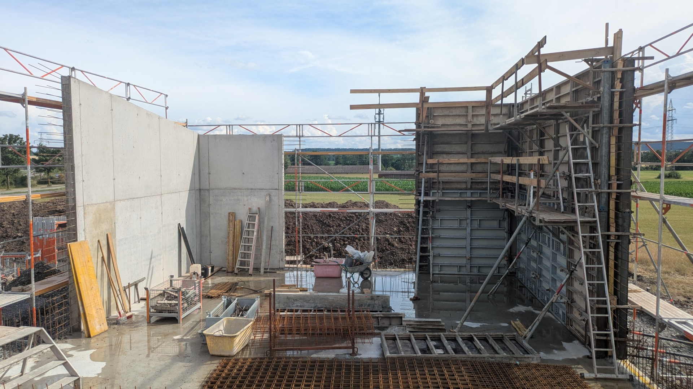
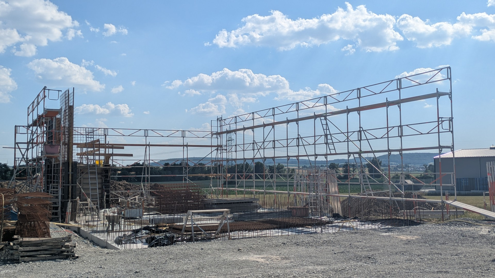

# Bauphase

{ width="605" loading=lazy }

## Baustart

Nach langer Wartezeit war es im Mai 2026 endlich so weit: Die Bauarbeiten begannen und die ersten Bagger rückten an.

Alles begann auf einer grünen Wiese.

{ width="605" loading=lazy }

## Erdarbeiten und Erschließung

Zu Beginn wurden die notwendigen Erdarbeiten durchgeführt und die Anschlüsse für die Versorgungsleitungen hergestellt. Dazu gehörten Wasser, Abwasser (Trennsystem), Strom sowie die Telekommunikationsanbindung.

{ width="300" loading=lazy }
{ width="300" loading=lazy }
{ width="300" loading=lazy }
{ width="300" loading=lazy }

## Vorbereitung der Fundamente

Nach Abschluss der Erdarbeiten wurde das Gelände geschottert und für die Fundamentarbeiten vorbereitet.

{ width="300" loading=lazy }
{ width="300" loading=lazy }

## Bau des Heizhauses

### Bodenplatte

Nachdem die erforderlichen Leitungen verlegt und der Zugangsschacht vorbereitet worden waren, wurde Mitte Juni die Bodenplatte für das Heizhaus betoniert.

{ width="300" loading=lazy }
{ width="300" loading=lazy }

### Rohbau

Auf der fertiggestellten Bodenplatte begann noch im Juni der Rohbau des Heizhauses. Zunächst wurden die Wände geschalt und betoniert.

{ width="300" loading=lazy }
{ width="300" loading=lazy }