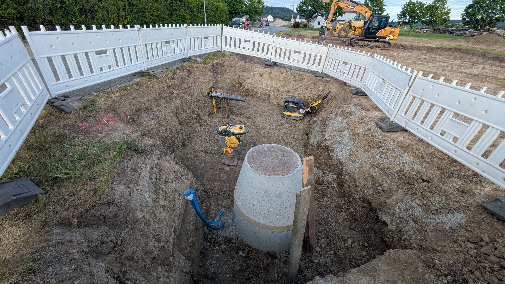
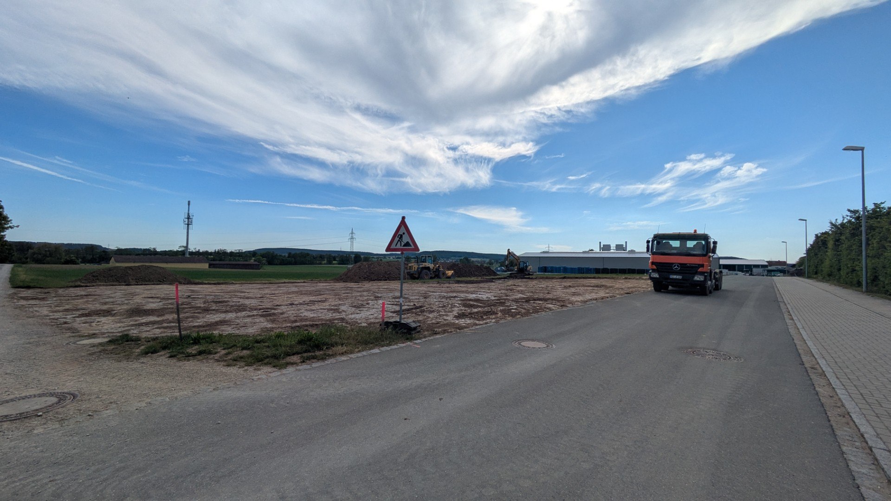

# Bauphase

Mitte Mai 2026 ging es nach langer Wartezeit endlich los! Die Bagger rollen.

Alles beginnt auf einer grünen Wiese.

{ width="300" loading=lazy }

Es folgen erste Erdarbeiten und Kanalanschluss (Wasser, Abwasser (Trennsystem), Telekom)

{ width="300" loading=lazy }
{ width="300" loading=lazy }
{ width="300" loading=lazy }
{ width="300" loading=lazy }

Im Anschluss wurden die Erdarbeiten abgeschlossen, geschottert und die Fundamente vorbereitet:

{ width="300" loading=lazy }
{ width="300" loading=lazy }