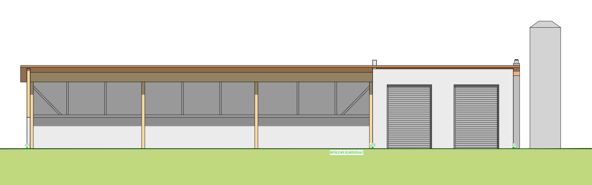

# Vorbereitung

Von der Idee zur Umsetzung.

## Die Idee (2024)

Die Idee für ein kommunales Wärmenetz in Baudenbach entstand 2024 auf Initiative der Gemeinde Baudenbach unter dem damaligen Bürgermeister Wolfgang Schmidt.

Da die Gemeinde mehrere kommunale Gebäude betreibt, in denen teilweise noch Ölheizungen oder in die Jahre gekommene Hackschnitzelheizungen genutzt werden, entstand zunächst der Gedanke, diese über eine gemeinsame Heizungsanlage zu versorgen.

Gleichzeitig sollte auch den Anliegern die Möglichkeit eröffnet werden, sich an das Wärmenetz anzuschließen.

Aus rechtlicher und praktischer Sicht kann und möchte die Gemeinde jedoch nicht selbst als Betreiber eines Wärmenetzes auftreten.

Daraus entwickelte sich das Konzept, eine Gesellschaft zu gründen, in der alle Anschlussnehmer gemeinsam ein Wärmenetz errichten und betreiben – möglichst kostengünstig und ohne Gewinnerzielungsabsicht.

## Vorbereitungen (2024–2026)

Im Laufe des Jahres 2024 fanden mehrere Informationsveranstaltungen statt. Ziel war es insbesondere, das Interesse an einem Anschluss an das Wärmenetz zu ermitteln.

Parallel dazu erwarb die Gemeinde Baudenbach ein geeignetes Grundstück, das künftig an den Wärmenetzbetreiber verpachtet werden soll.

### Gründung der Kapitalgesellschaft

Am 26. September 2024 wurde die Kapitalgesellschaft

`Wärmenetz Baudenbach Verwaltungs UG (haftungsbeschränkt)`

mit einer Stammeinlage von 2.000 € gegründet.

Zu Geschäftsführern wurden bestellt:

- Wolfgang Schmidt
- Reinhold Helm
- Markus Zellner

Alle drei Geschäftsführer sind gleichberechtigt und einzelvertretungsberechtigt.

Die Geschäftsanteile der Verwaltungs UG werden vollständig von der später gegründeten Gesellschaft gehalten.

### Gründung der Personengesellschaft

Am 12. Dezember 2024 wurde die Personengesellschaft

`Wärmenetz Baudenbach UG (haftungsbeschränkt) & Co. KG`

gegründet.

Als Komplementärin fungiert die zuvor gegründete Verwaltungs UG.

Als Kommanditisten beteiligen sich 13 Anschlussnehmer mit jeweils einem Kommanditanteil in Höhe von 100 € sowie die Gemeinde Baudenbach mit sechs Kommanditanteilen.

Damit ergeben sich 14 Kommanditisten mit insgesamt 19 Anteilen.

### Bestellung des Beirats

Gemäß der Satzung wurde im Dezember ein Beirat bestellt. Dem Beirat gehören an:

* Norbert Bärthlein
* Albert Kirschner
* Matthias Körner
* Tobi Köcklar

### Abschluss der Wärmeverträge

Im ersten Quartal 2025 konnten 27 Wärmeverträge abgeschlossen werden. Damit waren die Voraussetzungen für die Beantragung von Fördermitteln geschaffen.

### Planung

Parallel wurde die Planung weiter konkretisiert. Dabei wurden das Heizhaus mit Lagerhalle, die Leitungsführung sowie die technischen Anlagen im Detail geplant.

Auf dieser Grundlage wurden Angebote verschiedener Fachfirmen für die einzelnen Gewerke eingeholt.

{ width="600" loading=lazy }

### Antragstellung

Am 21. Mai 2025 wurde bei der BAFA (Bundesamt für Wirtschaft und Ausfuhrkontrolle) ein Förderantrag im Rahmen der Bundesförderung für effiziente Wärmenetze eingereicht.

Die Antragstellung erfolgte mit Unterstützung der Firma Enerpipe.

### Zuwendungsbescheid

Nach Einreichung des Antrags verlief das Verfahren zunächst über längere Zeit ohne weiteren Zwischenstand.

Erst in den letzten Monaten kam es zu Rückfragen sowie notwendigen Anpassungen der Planung aufgrund zwischenzeitlich geänderter Förderrichtlinien, bevor am 22. April 2026 der Zuwendungsbescheid erteilt wurde.

### Startschuss

Mit der Gesellschafterversammlung am 12. Mai 2026 wurde der Startschuss für die Bauphase gegeben.

### Geschäftsführerwechsel

Wolfgang Schmidt hat das Projekt als Erster Bürgermeister initiiert und die Planungen von der ersten Idee bis zur Umsetzungsreife maßgeblich vorangetrieben.

Seit Mai 2026 ist Johannes Hudezeck Erster Bürgermeister der Gemeinde Baudenbach und übernimmt als Geschäftsführer die Nachfolge von Wolfgang Schmidt.

Die Geschäftsführer Reinhold Helm und Markus Zellner bleiben unverändert im Amt. Alle Geschäftsführer sind weiterhin gleichberechtigt und jeweils einzelvertretungsberechtigt.

---

[Hier](Bauphase.md) geht es weiter zur Bauphase.